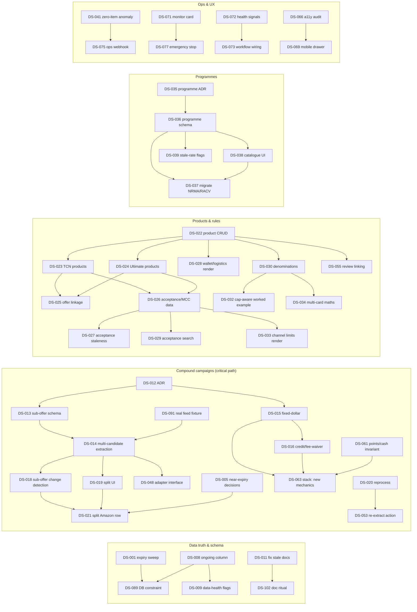

# DealStack AU backlog — dependency graph

> Generated 2026-07-13 from [DEALSTACK-BACKLOG.json](DEALSTACK-BACKLOG.json) (42 explicit edges over 108 tickets).
> Tickets with no edges (the majority) can start any time their iteration comes up.

## Mermaid



## Plain-text fallback (edge list, `dependency --> dependent`)

```
DS-008 --> DS-009, DS-089        DS-001 --> DS-089        DS-011 --> DS-102
DS-012 --> DS-013, DS-015        DS-013 --> DS-014        DS-091 --> DS-014
DS-014 --> DS-018, DS-019, DS-048
DS-018 --> DS-021    DS-019 --> DS-021    DS-005 --> DS-021
DS-015 --> DS-016, DS-063        DS-016 --> DS-063        DS-061 --> DS-063
DS-020 --> DS-053
DS-022 --> DS-023, DS-024, DS-028, DS-030, DS-055
DS-023 --> DS-025, DS-026        DS-024 --> DS-025, DS-026
DS-026 --> DS-027, DS-029, DS-033
DS-030 --> DS-032, DS-034
DS-035 --> DS-036                DS-036 --> DS-037, DS-038, DS-039
DS-038 --> DS-037
DS-041 --> DS-075    DS-071 --> DS-077    DS-072 --> DS-073    DS-066 --> DS-069
```

## Critical path

The longest dependency chain, and the one carrying the biggest live accuracy defect:

**DS-012 (ADR) → DS-013 (schema) → DS-014 (multi-candidate extraction) → DS-018/DS-019 (change detection / split UI) → DS-021 (split the published 33-brand Amazon row)** — five stages, two of them human-gated (migration apply; production split). DS-091 (real feed fixture) feeds DS-014 and should land in Iteration 03, well before the chain starts.

Second-longest: **DS-022 → DS-023/DS-024 → DS-026 → DS-029** (product CRUD → product data → acceptance data → acceptance search), four stages, mostly human data-entry gated.

## Blockers by class

- **Migration blockers (future migrations, all needing explicit approval to apply):** DS-008 gates DS-009/DS-089; DS-013 gates the whole compound chain; DS-036 gates programmes; DS-030 gates denomination maths; smaller: DS-044 (streak column), DS-046 (retention), DS-087 (index), DS-103 (report table). **Nothing is blocked by migration 022 — it is applied to production and verified** (handoff §D); the corrections it enables are gated on data review, not schema.
- **Production-data / review blockers:** DS-089 needs the DS-001 sweep (constraint must have zero violators); DS-021 needs DS-005's decision; DS-025/DS-026/DS-037 need human data entry with per-row approval; DS-007's queue outcomes shape DS-004.
- **Architecture blockers (user decision required before code):** DS-012 (compound representation), DS-035 (programme entity), DS-086 (DB test harness posture), DS-082 (CSP enforce), DS-105/DS-106/DS-108 (growth design-first).

## Parallel workstreams

These groups touch disjoint files and can run concurrently once their iteration opens:

1. **Data corrections** (DS-001..DS-007, human/admin) — no code conflicts with anything.
2. **CI/devex** (DS-090, DS-097, DS-098, DS-093, DS-096) — workflow + scripts only.
3. **Security probes** (DS-079, DS-080, DS-085, DS-081) — scripts/ + lib/security/.
4. **Ingestion hardening** (DS-041..DS-047) — lib/giftcards/runIngest + tests.
5. **Ops surfaces** (DS-071..DS-077) — admin monitor + health.
6. **Public UX** (DS-064..DS-070, DS-094) — app/gift-cards + components.
7. **Stack truth** (DS-058..DS-062) — lib/stack/.

Avoid running groups 4 and 5 in the same session as each other only where both touch `lib/admin/repos/giftCardPipeline.ts` (DS-041/DS-044 vs DS-071/DS-072) — sequence within one branch instead.

## Highest-leverage unlockers

| Ticket | Directly unlocks | Transitively opens |
|---|---|---|
| DS-022 product CRUD | 5 tickets | the entire C/D chain (10 tickets) |
| DS-012 compound ADR | 2 | the entire B chain + DS-063, DS-048 (11 tickets) |
| DS-014 multi-candidate extraction | 3 | DS-021 split + adapter work |
| DS-026 acceptance data | 3 | acceptance search, channel limits, staleness |
| DS-036 programme schema | 3 | all programme UX |
| DS-008 ongoing column | 2 | the data-integrity constraint pair |
| DS-091 real feed fixture | 1 | de-risks every Epic B design decision |
